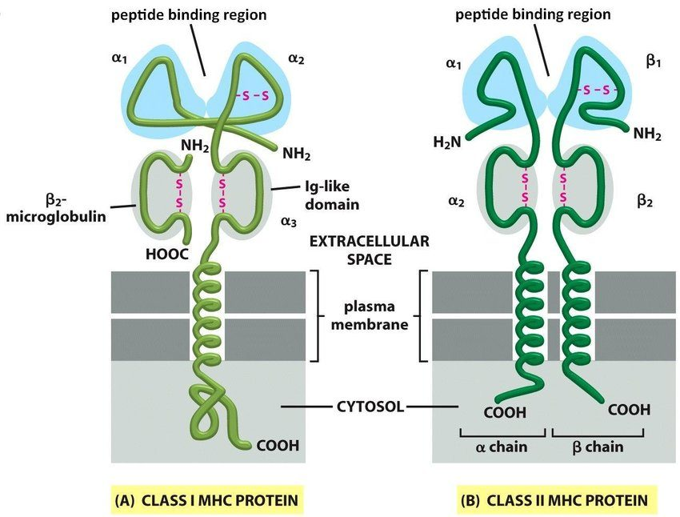
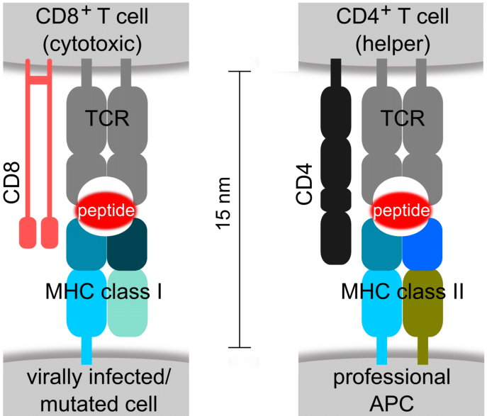
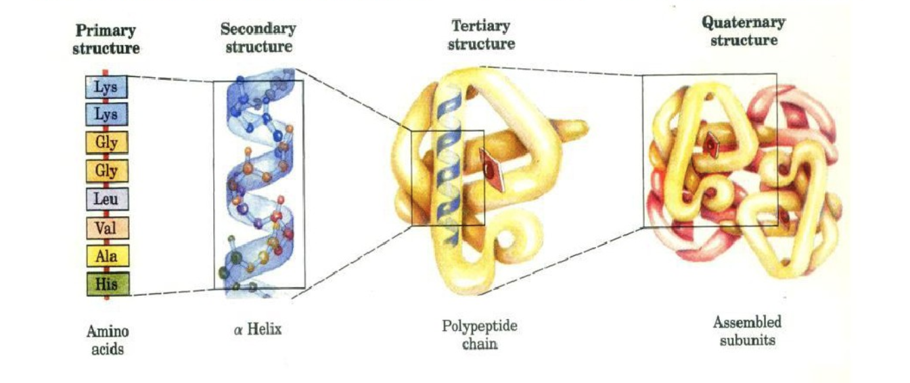

<head>
    
    
</head>

# TCR-HLA-peptide binding

- [TCR-HLA-peptide binding](#tcr-hla-peptide-binding)
  - [Biological knowledge](#biological-knowledge)
  - [Large pre-trained model](#large-pre-trained-model)
  - [Sequence (primary structure)](#sequence-primary-structure)
  - [Higher level structures](#higher-level-structures)

## Biological knowledge
|HLA-pep binding|TCR-HLA-pep binding|
|:-:|:-:|
|||
|[Image source](https://microbiologynotes.org/major-histocompatibility-complex-mhc-introduction-types-and-differences/)|[Image source](https://www.researchgate.net/figure/MHC-class-I-and-class-II-and-their-role-as-mediators-during-antigen-presentation-and_fig1_280663544)|
- [ ] [Structure of the complex between human T-cell receptor, viral peptide and HLA-A2](http://www.nature.com/articles/384134a0) (1996 Nature)
  - "The interface between TCR and MHC/pcptide is in unambiguous electron density, as are the **$\pmb{\alpha}$2, $\pmb{\alpha}$2, and $\pmb{\beta}$2-microglobulin ($\pmb{\beta}$2m) domains of the MHC** and the **V$\pmb{\alpha}$ and V$\pmb{\beta}$ domains of the TCR**."
- [ ] [Classification of Human Leukocyte Antigen (HLA) Supertypes](http://link.springer.com/10.1007/978-1-4939-1115-8_17) (2014 Immunoinformatics)

## Large pre-trained model
- [ ] [[Survey] Learning functional properties of proteins with language models](https://www.nature.com/articles/s42256-022-00457-9) (2022 NMI)
  - sequence-based
- [ ] [[Survey] A Survey on Protein Representation Learning: Retrospect and Prospect](http://arxiv.org/abs/2301.00813) (2023 arxiv)
  - sequence-based, structure-based, and sequence-structure co-modeling
  - Methods mentioned in the paper are summarized in their [Reading List](https://github.com/LirongWu/awesome-protein-representation-learning).

---

## Sequence (primary structure)
- [ ] [NetMHCpan, a Method for Quantitative Predictions of Peptide Binding to Any HLA-A and -B Locus Protein of Known Sequence](https://dx.plos.org/10.1371/journal.pone.0000796) (2007)
  - HLA: pseudo sequence 
- [ ] [NetMHCpan-4.0: Improved Peptide–MHC Class I Interaction Predictions Integrating Eluted Ligand and Peptide Binding Affinity Data](https://journals.aai.org/jimmunol/article/199/9/3360/109797/NetMHCpan-4-0-Improved-Peptide-MHC-Class-I) (2017)
  - HLA: pseudo sequence 
- [ ] [Deep learning-based prediction of the T cell receptor–antigen binding specificity](https://www.nature.com/articles/s42256-021-00383-2 "pMTnet") (2021 NMI)
  - HLA: pseudo sequence 
  - TCR: CDR3$\beta$ sequence
- [ ] [A transformer-based model to predict peptide–HLA class I binding and optimize mutated peptides for vaccine design](https://www.nature.com/articles/s42256-022-00459-7 "TransPHLA") (2022 NMI)
  - HLA: pseudo sequence

## Higher level structures