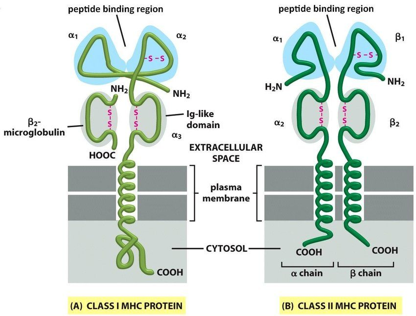
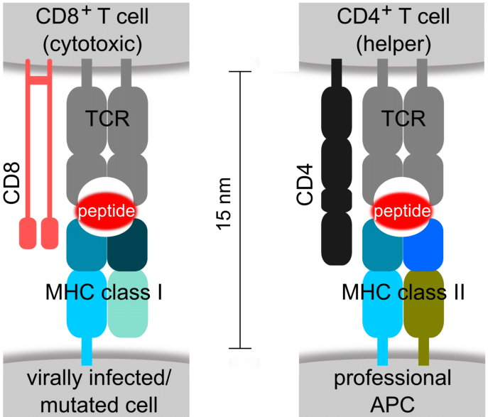

👈 [Back to Home Page](../README.md/)

# Immunity-related
- [Immunity-related](#immunity-related)
  - [TCR-HLA-peptide Binding Prediction](#tcr-hla-peptide-binding-prediction)
    - [HLA-Peptide interaction](#hla-peptide-interaction)
    - [TCR-HLA-peptide interaction](#tcr-hla-peptide-interaction)
  - [Antibody](#antibody)

📘 Related resources on Github: [TCR-BCR-seq-analysis](https://github.com/crazyhottommy/TCR-BCR-seq-analysis), [awesome-vdj](https://github.com/slowkow/awesome-vdj)

## TCR-HLA-peptide Binding Prediction

Intro: **T-cell receptor (TCR), peptide, and human leukocyte antigen (HLA) interactions** play a crucial role in the adaptive immune response, orchestrating the recognition and targeting of foreign substances, such as pathogens or cancer cells. 

|HLA-pep binding|TCR-HLA-pep binding|
|:-:|:-:|
|||

### HLA-Peptide interaction

|   |Title|Pub.&Year|Notes|
|---|-----|---------|-----|
||[Structure of the complex between human T-cell receptor, viral peptide and HLA-A2](http://www.nature.com/articles/384134a0)|Nature '1996|
|[Survey]|[Toward more accurate pan-specific MHC-peptide binding prediction: a review of current methods and tools](https://pubmed.ncbi.nlm.nih.gov/21949215/)|Brief Bioinform '2011|
||[Classification of Human Leukocyte Antigen (HLA) Supertypes](http://link.springer.com/10.1007/978-1-4939-1115-8_17)|Immunoinformatics '2014|
||[Predicting Antigen Presentationwhat Could we Learn From a Million Peptides?](https://www.ncbi.nlm.nih.gov/pmc/articles/PMC6068240/)||
|NetMHCpan|[NetMHCpan, a Method for Quantitative Predictions of Peptide Binding to Any HLA-A and -B Locus Protein of Known Sequence](https://dx.plos.org/10.1371/journal.pone.0000796)|PLOS ONE '2007|||
|NetMHCpan-4.0|[NetMHCpan-4.0: Improved Peptide–MHC Class I Interaction Predictions Integrating Eluted Ligand and Peptide Binding Affinity Data](https://journals.aai.org/jimmunol/article/199/9/3360/109797/NetMHCpan-4-0-Improved-Peptide-MHC-Class-I)|2017|
|TransPHLA|[A transformer-based model to predict peptide–HLA class I binding and optimize mutated peptides for vaccine design](https://www.nature.com/articles/s42256-022-00459-7)|NMI '2022|[code](https://github.com/a96123155/TransPHLA-AOMP)|
|HLAncPred|[HLAncPred: a method for predicting promiscuous non-classical HLA binding sites](https://academic.oup.com/bib/article-abstract/23/5/bbac192/6587168?redirectedFrom=fulltext)|Bioinformatics '2022|
||[Interpreting BERT architecture predictions for peptide presentation by MHC class I proteins](https://arxiv.org/abs/2111.07137)||
||[Improved Predictions of MHC-Peptide Binding using Protein Language Models](https://www.biorxiv.org/content/10.1101/2022.02.11.479844v1)||
||[Peptide-binding specificity prediction using fine-tuned protein structure prediction networks](https://www.pnas.org/doi/10.1073/pnas.2216697120)|PNAS '2023|
||||

👆 [Back to Top](#immunity-related)

### TCR-HLA-peptide interaction

|   |Title|Pub.&Year|Notes|
|---|-----|---------|-----|
|ImRex|[Current challenges for unseen-epitope TCR interaction prediction and a new perspective derived from image classification](https://academic.oup.com/bib/article/22/4/bbaa318/6042663)||
|TCRex|[Detection of Enriched T Cell Epitope Specificity in Full T Cell Receptor Sequence Repertoires](https://www.frontiersin.org/articles/10.3389/fimmu.2019.02820/full)||
|DeepTCR|[DeepTCR is a deep learning framework for revealing sequence concepts within T-cell repertoires](https://www.nature.com/articles/s41467-021-21879-w)||
|DeepTCR2|[Deep learning reveals predictive sequence concepts within immune repertoires to immunotherapy](https://www.science.org/doi/10.1126/sciadv.abq5089)||
|ERGO-II|[Contribution of T Cell Receptor Alpha and Beta CDR3, MHC Typing, V and J Genes to Peptide Binding Prediction](https://www.frontiersin.org/articles/10.3389/fimmu.2021.664514/full)||
|TCRAI-ICON|[A framework for highly multiplexed dextramer mapping and prediction of T cell receptor sequences to antigen specificity](https://www.science.org/doi/10.1126/sciadv.abf5835)|Science Advanced '2021|
|pMTnet|[Deep learning-based prediction of the T cell receptor–antigen binding specificity](https://www.nature.com/articles/s42256-021-00383-2)|NMI '2021|
|PanPep|[Pan-Peptide Meta Learning for T-cell receptor–antigen binding recognition](https://www.nature.com/articles/s42256-023-00619-3)|NMI '2023|👍|
|TEIM|[[TEIM] s with deep learning](https://www.nature.com/articles/s42256-023-00634-4)|NMI '2023|
|[Benchmark]|[Benchmarking solutions to the T-cell receptor epitope prediction problem: IMMREP22 workshop report](https://www.sciencedirect.com/science/article/pii/S2667119023000046)|ImmunoInformatics '2023|
|[survey]|[Can we predict T cell specificity with digital biology and machine learning?](https://www.nature.com/articles/s41577-023-00835-3)|Nature reviews '2023|
|TCRdock|[Structure-based prediction of T cell receptor: peptide-MHC interactions](https://elifesciences.org/articles/82813)|Elife '2023|
|pMTnet_Omni|||
||||

👆 [Back to Top](#immunity-related)

## Antibody

|   |Title|Pub.&Year|Notes|
|---|-----|---------|-----|
||[Efficient evolution of human antibodies from general protein language models](https://www.nature.com/articles/s41587-023-01763-2)|NBT '2023|
|PALM-H3|[De novo generation of SARS-CoV-2 antibody CDRH3 with a pre-trained generative large language model](https://www.nature.com/articles/s41467-024-50903-y)|NC '2024|

👆 [Back to Top](#immunity-related)